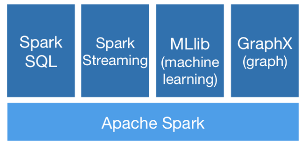
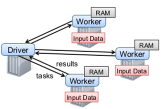

[toc]

_lighting-fast unified analytics engine_

# preface

用了这么长时间的spark一直没有静下心来总结一下这一段时间的学习和心得体会。这里整理成一个文档从浅到深来归纳总结，方便以后回顾时查阅方便

这个github将包含一系列用scala编写的demo, 数据集, spark的使用心得和踩坑，以及架构解释。如有错误，欢迎指正。

GitHub地址： https://github.com/Esail/sparkwiki

# Reference:

## websites

[1] https://spark.apache.org/ (不用多说，官网是最好的文档，实践是最好的老师，源码是最佳的解释）

[2] https://www.cnblogs.com/qingyunzong/p/8886338.html (非常好的个人总结）

[3] https://www.jianshu.com/p/a2c2fe4371ea (hadoop3.0 new features)

## papers

[1] Resilient Distributed Datasets: A Fault-Tolerant Abstraction for In-Memory Cluster Computing (了解spark的诞生过程）

# spark overview

## what is spark?
spark官方给出的说明是，spark是一个**高效(light-fast)，统一(unified)，分析引擎(analytics engine)**
 
* 高效是因为spark是分布式的，并且基于内存来做计算.无论是在量还是在速上都有显著的提升
* 统一意味着它可以干任何和数据分析相关的工作，从sql到streaming,再到ml，图计算都可以在以rdd为核心的spark引擎上完成。
* 分析引擎 spark是分析引擎，意味着它不负责数据的采集和数据的储存，你还需要依赖hdfs,hbase,cassandra来作为数据的储存介质，通过kafka,rabbitMQ等来收集日志。

下图展示了spark的组成：

## spark architecture

这里简单的讲一下spark的结构，我们后面还会结合hadoop-yarn来具体讲一下。推荐所有人读Matei的__Resilient Distributed Datasets: A Fault-Tolerant Abstraction for In-Memory Cluster Computing__ 详细了解下spark的核心思想RDD的设计和实现

